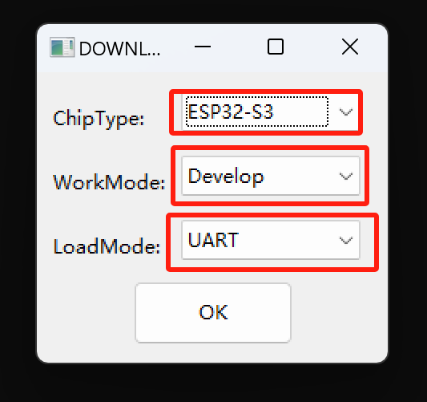
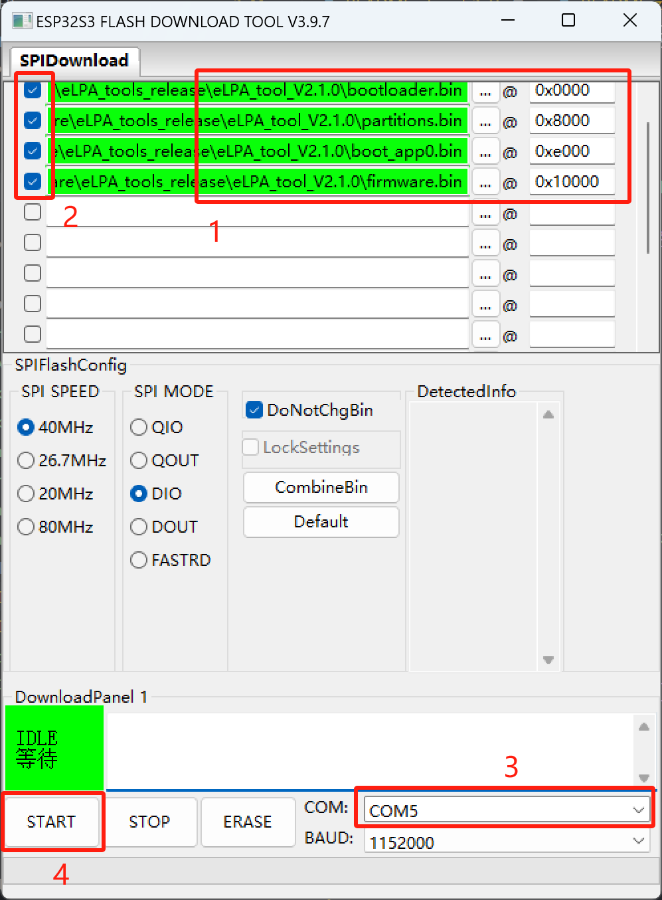

# About 9esim mini tool firmware

English | [简体中文](README_zh.md)

The 9esim mini tool is an external (or we called extension) LPA on a board, which based on ESP32S3.

Sorry for the delay! The firmware comes a little late because we encountered some problems in the debugging process. Now, we have solved these problems, and the firmware is ready. And we are also constantly optimizing the firmware to provide you with a better experience.

**Statement:
    Upgrading the firmware requires a certain amount of computer basic knowledge and some hands-on ability. Although we have not encountered any situation where the upgrade fails, there is nothing absolute in the world. Currently, the official does not have enough human resources to support everyone in the problems encountered during the firmware upgrade process, so please think twice before upgrading the firmware.**

## Requirements

The GUI firmware flash download tool of Espressif only supports Windows system so far. If you are using other operating systems, you can use the command line tool `esptool.py` to flash the firmware.

## File Description

- `flash_download_tool_3.9.7_1.zip`: The firmware download tool provided by Espressif, used to burn the firmware to the 9esim mini tool. You can download it from the [Espressif official tool download page](https://www.espressif.com/en/support/download/other-tools).

Mini tool firmware files:

- boot_app0.bin
- bootloader.bin
- partitions.bin
- firmware.bin

## Firmware Update Steps

1. Download the firmware update tool `flash_download_tool_3.9.7_1.zip` and unzip it to any directory.

2. Double-click to open the `flash_download_tool_3.9.7.exe` in the unzipped directory, and configure the parameters as shown in the figure below:

   

   - ChipType choose `ESP32-S3`
   - WorkMode choose `Develop`
   - LoadMode choose `UART`

3. Download the mini tool firmware files and unzip them to any directory.

4. Connect the 9esim mini tool to the computer and confirm whether the serial device is recognized. You can view the port number of the serial device in the device manager:
   

     **Note: If you cannot see the device information such as `CH340` after connecting the mini tool to the PC via USB type-C, you need to reverse the USB connected to the mini tool by 180 degrees and then plug it in.**

5. Connect the 9esim mini tool to the computer, and configure the serial port parameters as shown in the figure below:

    

    - The address corresponding to each firmware file is as follows:
      - boot_app0.bin: 0xe000
      - bootloader.bin: 0x0000
      - partitions.bin: 0x8000
      - firmware.bin: 0x10000
    - Check the checkbox in front of each file, otherwise the file will not be burned.
    - Port choose `COMx` (x is the serial port number), check the serial port number through the previous step. You can only click the drop-down box to select, and cannot enter manually.
    - Baudrate choose the maximum `1152000`, if the burning fails, you can try a smaller baud rate.

6. Click the `START` button to start burning the firmware. After the burning is completed, a prompt will appear.

7. After the burning is completed, short press the reset button of the mini tool to restart the mini tool. If you can see the blue light flashing, it means that the firmware burning is successful. You can also view the current firmware version through the WeChat mini program. (For users who are inconvenient to use the WeChat mini program, we will provide more operation methods in the future, please be patient.)

Please note: During the firmware burning process, please do not disconnect the mini tool from the computer to avoid damaging the firmware.
