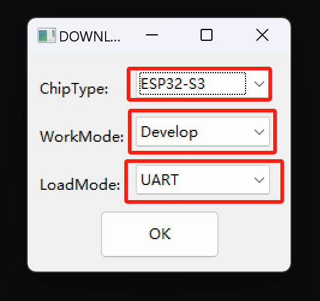
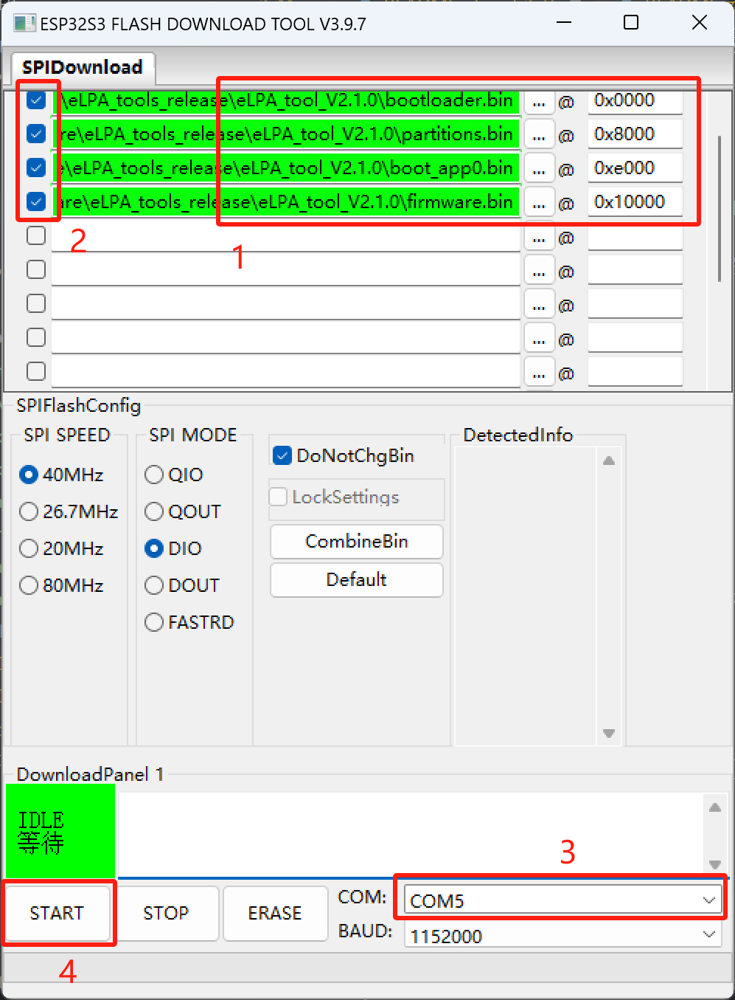

# 关于 9esim 小工具固件说明

[English](Readme.md) | 简体中文

9esim 小工具是一个基于 ESP32S3 的外部（我们也称之为扩展）LPA工具。

非常抱歉！这个固件来得有点晚。主要是因为我们在调试过程中遇到了一些问题。现在，我们已经解决了这些问题，固件已经准备好了。而且，我们也在不断地优化固件，以便为您提供更好的体验。

**声明：
    升级固件需要一定的计算机基础知识以及一些动手能力。虽然我们目前还没有碰到过无法升级或升级失败的情况，但世上没有绝对的事情。目前官方没有足够人力资源支撑大家在固件升级过程中遇到的问题，所以请您在升级固件之前三思。**

## 要求

乐鑫的GUI固件更新工具仅支持Windows系统。如果您熟悉官方的命令行烧录工具则可以在Linux和MacOS上进行操作，具体使用方法请参考乐鑫官网。这里仅介绍GUI工具。

## 文件说明

- `flash_download_tool_3.9.7_1.zip`：乐鑫官方提供的固件下载工具，用于将固件烧录到 9esim 小工具中。您可以在[乐鑫官方工具下载页面](https://www.espressif.com/en/support/download/other-tools)下载。

小工具固件文件：

- boot_app0.bin
- bootloader.bin
- partitions.bin
- firmware.bin

## 固件更新步骤

1. 下载固件更新工具 `flash_download_tool_3.9.7_1.zip`，并解压到任意目录。
2. 双击打开解压目录下的 `flash_download_tool_3.9.7.exe`，并按下图所示配置参数：

   

   - ChipType 选择 `ESP32-S3`
   - WorkMode 选择 `Develop`
   - LoadMode 选择 `UART`
3. 下载小工具固件文件，解压到任意目录。
4. 将 9esim 小工具连接到电脑，并确认是否识别到串行设备。您可以在设备管理器中查看串行设备的端口号：
   

   **请注意：如果小工具通过USB type-C连接到PC后看不到 `CH340`这样的设备信息，那么需要将连接小工具的一端的USB反转180度再插入。**
5. 将 9esim 小工具连接到电脑，按下图所示配置串口参数：

   

   - 每个固件文件对应的地址如下：
     - boot_app0.bin：0xe000
     - bootloader.bin：0x0000
     - partitions.bin：0x8000
     - firmware.bin：0x10000
   - 每个文件前的复选框勾选上，否则将不会烧录该文件。
   - Port 选择 `COMx`（x 为串口号），通过上一步查看串口号。只能点击下拉框选择，不能手动输入。
   - Baudrate 选择最大 `1152000`，如果无法烧录成功，可以尝试使用更小的波特率。
6. 点击 `START` 按钮，开始烧录固件。烧录完成后，会提示完成。
7. 烧录完成后，短按小工具的复位键，即可重启小工具，若可以看到蓝灯闪烁，表示固件烧录成功。您也可以通过微信小程序查看当前固件版本。（对于不便使用微信小程序的用户，我们会在后续提供更多操作方式，请您耐心等待。）

请注意：固件烧录过程中，请不要断开小工具与电脑的连接，以免造成固件损坏。
